# Project Zenith - System Workflow Diagram

## 🏗️ Architecture Overview

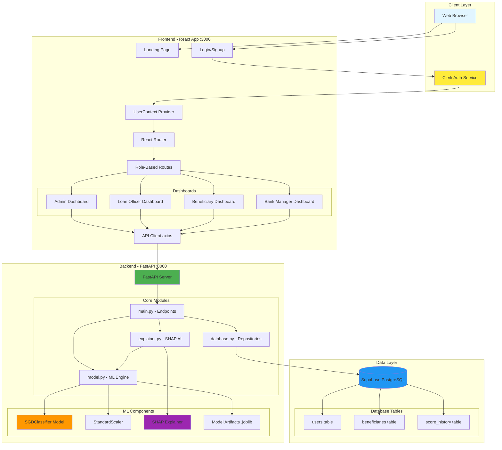

## 🔄 User Authentication Flow

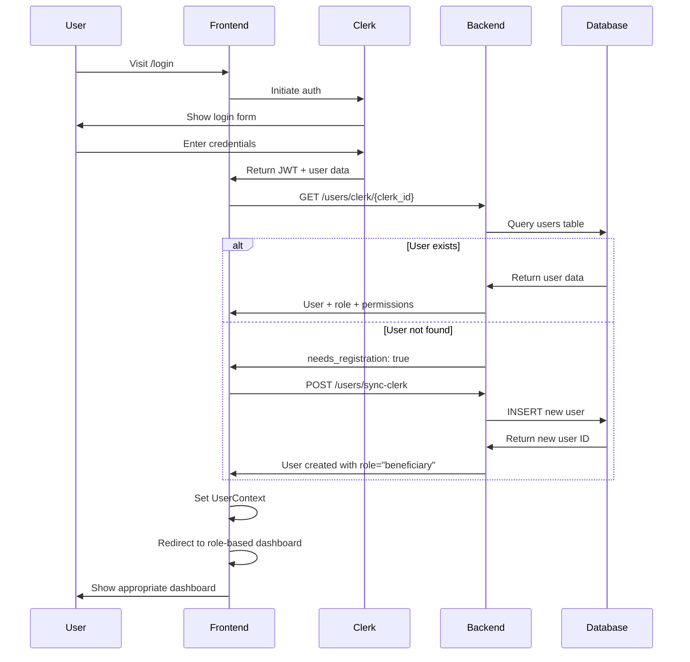

## 📊 Credit Score Calculation Flow

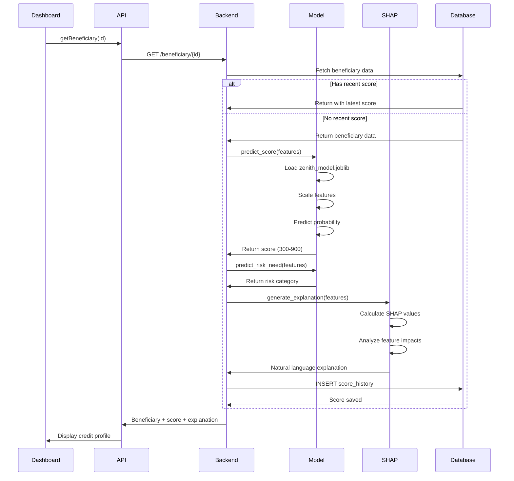

## 🔄 Online Learning Flow (Model Update)

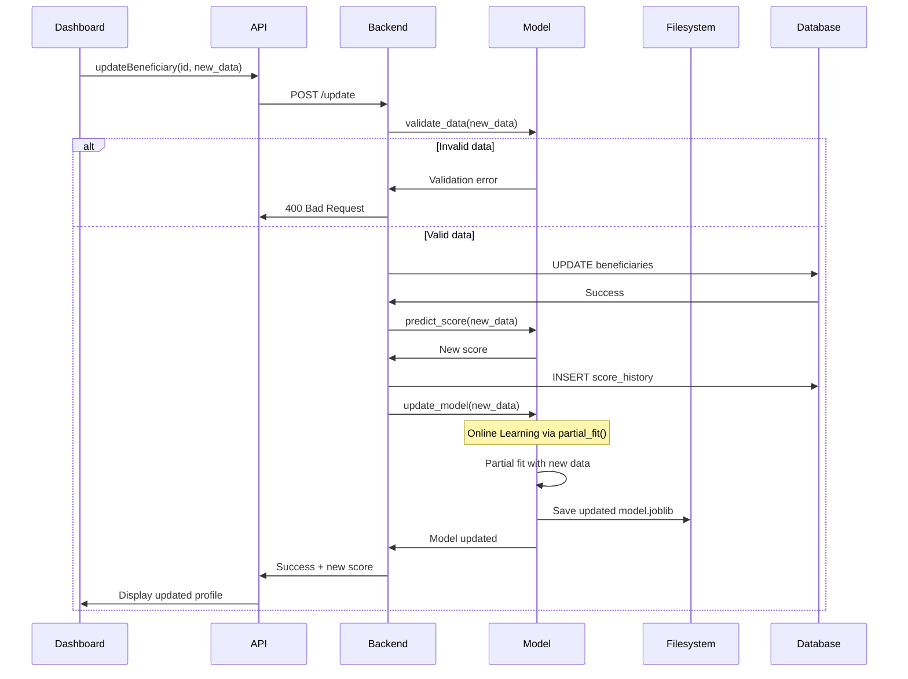

## 🎯 Score Simulation Flow (What-If Feature)

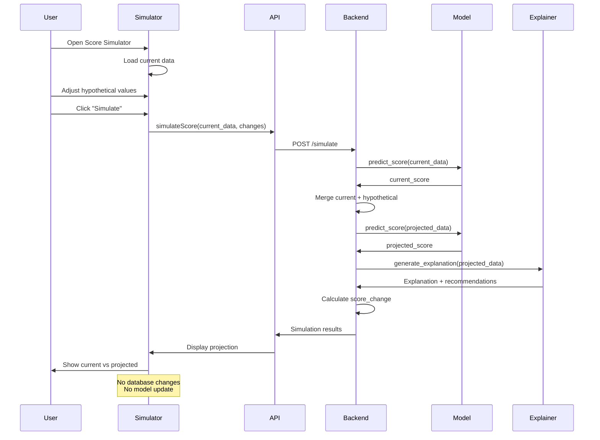

## 🔐 Role-Based Access Control

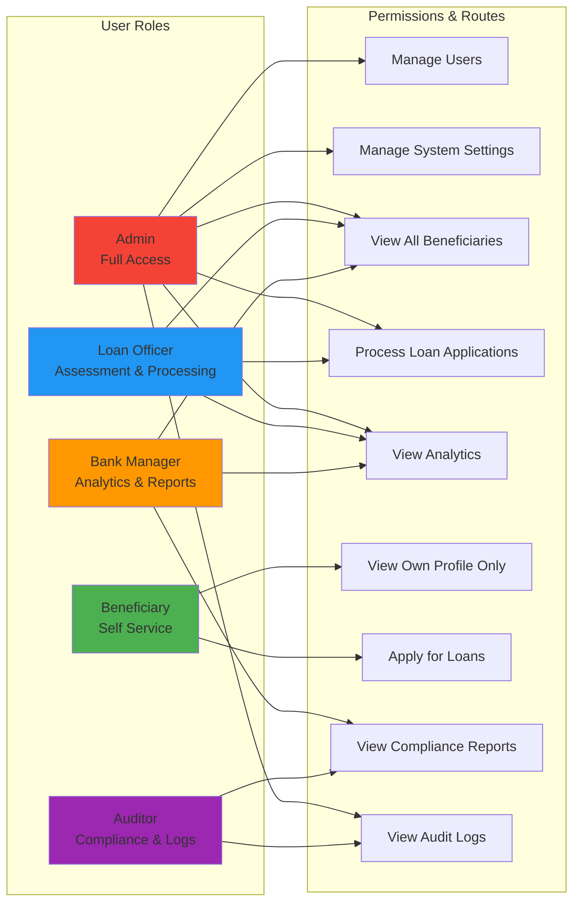

## 🚀 Development Workflow

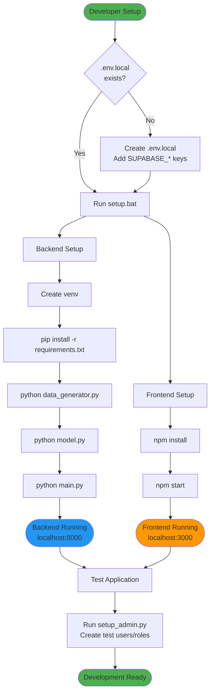

## 📡 API Endpoint Map

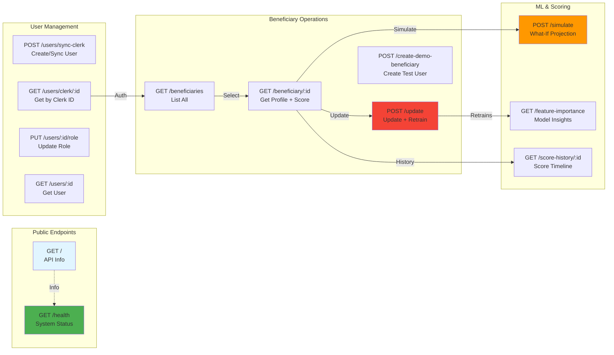

## 🗄️ Database Schema Relations

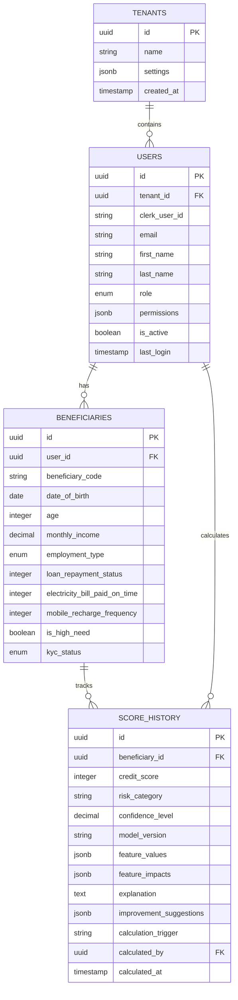

## 🎯 Key Features Flow

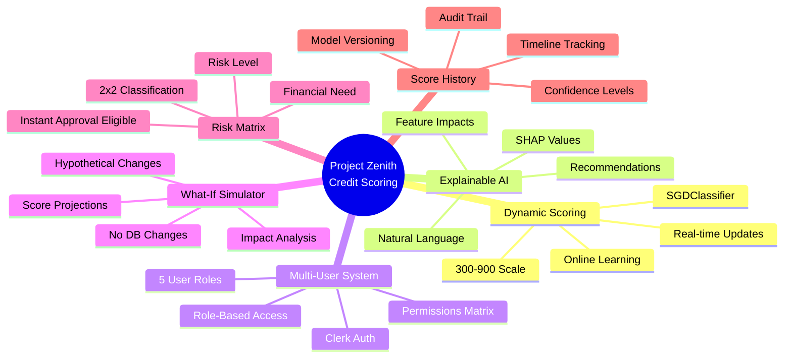

## 🔧 Technology Stack

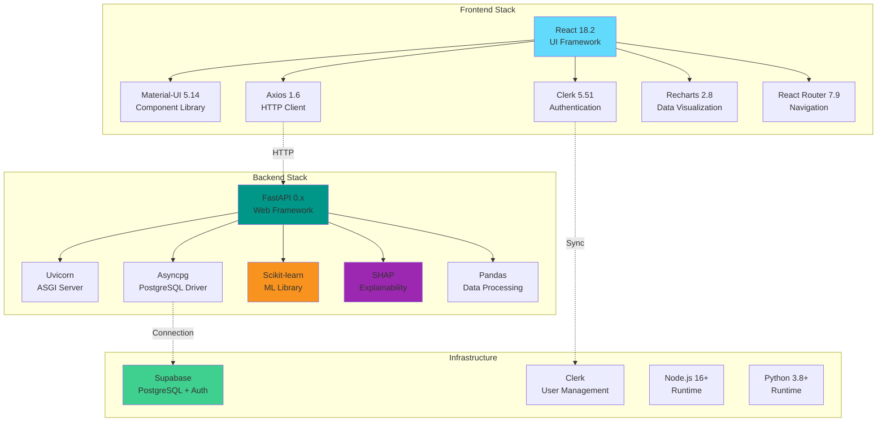

---

## 📝 Quick Reference Commands

### Setup
```bash
# One-time setup (Windows)
setup.bat

# Manual backend setup
cd backend
python -m venv venv
venv\Scripts\activate
pip install -r requirements.txt
python data_generator.py
python model.py
python main.py

# Manual frontend setup
cd frontend
npm install
npm start
```

### Start Servers
```bash
# Start both servers (Windows)
start-servers.bat
# or
start-both-servers.bat

# Manual start
cd backend && venv\Scripts\activate && python main.py
cd frontend && npm start
```

### Testing & Admin
```bash
# Create admin/test users
python setup_admin.py

# Test API health
curl http://localhost:8000/health

# Test beneficiaries endpoint
curl http://localhost:8000/beneficiaries
```

### Deployment
```bash
# Backend production
pip install gunicorn
gunicorn main:app -w 4 -k uvicorn.workers.UvicornWorker

# Frontend production
npm run build
serve -s build
```

---

## 🎓 Learning Path for New Developers

1. **Start Here**: Read `README.md` and `HOW_TO_RUN.md`
2. **Setup**: Run `setup.bat` and verify both servers start
3. **Explore API**: Visit http://localhost:8000 and http://localhost:8000/health
4. **Test Frontend**: Sign up at http://localhost:3000
5. **Create Roles**: Run `python setup_admin.py` to create test users
6. **Study Code**:
   - Backend: `main.py` → `model.py` → `explainer.py` → `database.py`
   - Frontend: `App.js` → `api/api.js` → `contexts/UserContext.js` → role dashboards
7. **Test Features**: Try score simulation, beneficiary updates, role switching

---

*Generated: October 15, 2025*  
*Project: Zenith - Dynamic Credit Scoring & Guidance System*
